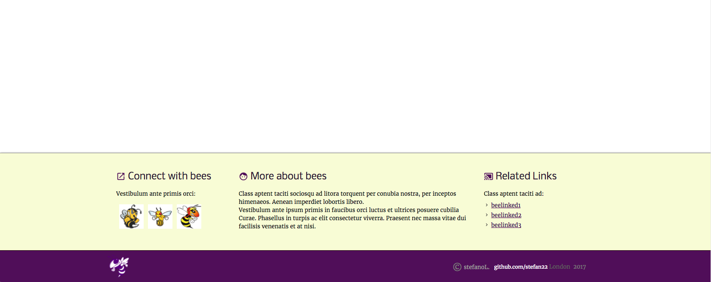

## <kbd>the</kbd> beeShow  <kbd>:honeybee: </kbd>
#### to clone:
- git clone
- npm,bower,bundler dependencies
- type grunt

  <kbd>bees-on-canvas :honeybee:</kbd>
  
  
  
  
  

    
  
  <kbd>bees canvas :honeybee:</kbd>
  
  

  
   
  
  <kbd>topsection :honeybee:</kbd>
  
  

  
   
  
  <kbd>side-navigation :honeybee:</kbd>
  
  

  
  
  

  
   
  
  <kbd>bottom-bees-pg :honeybee:</kbd> sticky footer
  
  
  
  
  
   

  
   
  
  <kbd>console :honeybee:</kbd> could it have done this earlier
  
  
  
  
  
  
  

  
   
  
  <kbd>iphone6 :honeybee:</kbd> 
  
  
  
  
  
  

  
   
  
  <kbd>iphone6 :honeybee:</kbd> 
  
  
  
  
  
  
  
  
  
  
  
  

